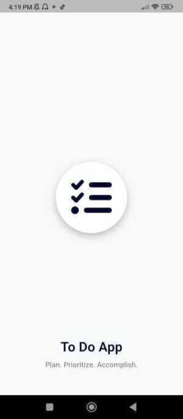
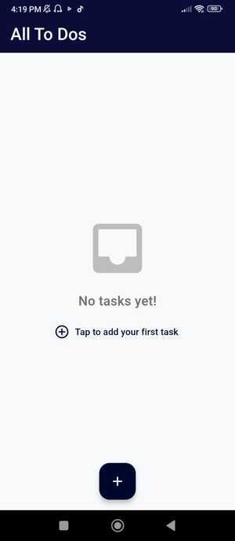
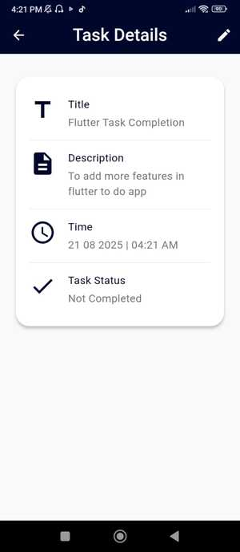
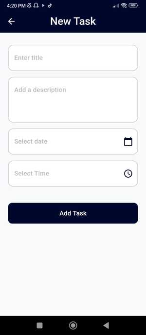

# 📝 ToDoApp

A simple and elegant ToDo list application built with **Flutter**. Organize your tasks, set priorities, and track your productivity all in one place.

## 📱 App Overview
ToDo App is a simple and elegant task management app built with Flutter. It helps users organize their daily tasks by allowing them to add, edit, view, complete, and delete to-dos. All tasks are saved locally using SharedPreferences, making the app fast and usable offline.

## 🚀 Features

- 📋 Create, update, and delete tasks
- ✅ Mark tasks as complete/incomplete
- 🗓️ Due date/time support
- 📱 Clean and responsive UI for mobile devices
- 💾 Persistent local storage using `shared_preferences`
- 📝 Add titles, descriptions, dates & times
- 🔁 Splash screen with animation
- 🧠 Input field validation to prevent empty submissions

## 📂 Project Structure

```
lib/
├── constant/
│   ├── colors.dart
│   └── textStyles.dart
│
├── model/
│   └── todo.dart
│
├── view/
│   └── home/
│       ├── splash_screen.dart
│       ├── home_screen.dart
│       ├── task_detail_screen.dart
│       ├── add_new_task_screen.dart
│       ├── to_do_item.dart
│       └── widgets/
│           ├── custom_button.dart
│           ├── custom_input_field.dart
│           └── build_detail_item.dart
│
└── main.dart
```

## 📸 Screenshots










## 🔮 Future Enhancements

- 🔔 Push notifications for upcoming tasks
- 📅 Calendar view for better task management  
- 📂 Task categorization (e.g., Work, Personal, Urgent)
- 🔍 Search and filter functionality
- ☁️ Cloud sync using Firebase or other backend
- 🗣️ Multi-language support (Localization)

## 👨‍💻 Author
Bakhtawar1910
🔗 [GitHub Profile](https://github.com/Bakhtawar1910)